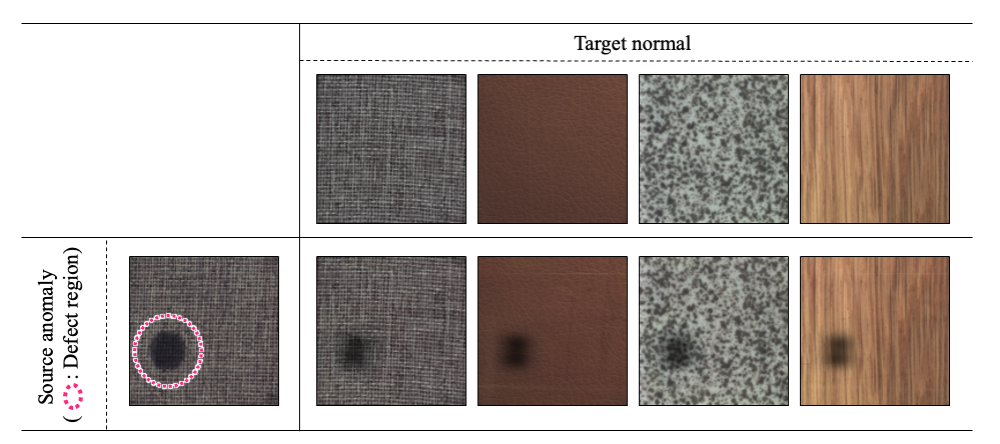
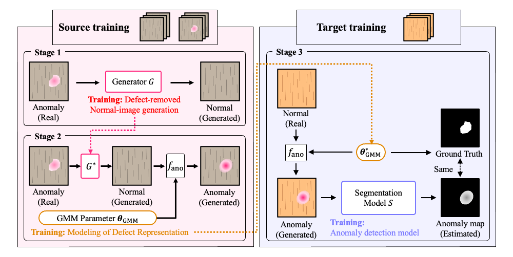
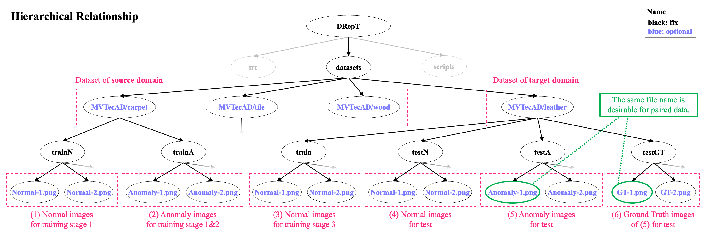
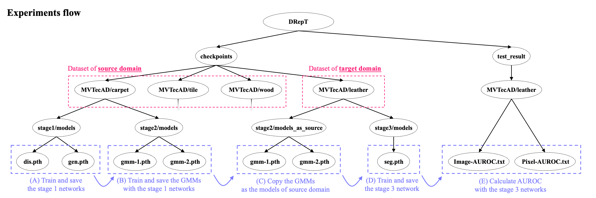

# DRepT — Official PyTorch Implementation

This is the official implementation of the paper **"DRepT: Anomaly Detection Based on Transfer of Defect Representation with Transmittance Mask"** in *2023 International Joint Conference on Neural Networks (IJCNN)* [1].



## 1. Overview

### (1) Abstract
The purpose is to improve the accuracy of anomaly detection for the target domain in surface anomaly detection (i.e., defect detection).<br>
DRepT uses an anomaly image in the source domain and transfers its defect representation to a normal image in the target domain.<br>
As a result, an anomaly image for the target domain is generated with high quality, and these anomaly images can be used for training the anomaly detection model.



### (2) Data available for training
Source domain: Normal images and Anomaly images (without Ground Truth) <br>
Target domain: Normal images only <br>

## 2. Preparation

### (1) Requirement

```
$ pip3 install torch torchvision numpy pillow tqdm tb-nightly future natsort opencv-python
```

### (2) Git clone
```
$ git clone https://github.com/koba-jon/DRepT.git
$ cd DRepT
```

### (3) Set dataset

Example of [MVTecAD](https://www.mvtec.com/company/research/datasets/mvtec-ad)[2]: <br>
```
$ ln -s <mvtec_anomaly_detection_dataset_path> ./datasets/mvtec_anomaly_detection
$ bash datasets/MVTecAD_convert.sh
```



## 3. Usage

Example of [MVTecAD](https://www.mvtec.com/company/research/datasets/mvtec-ad)[2] (Source: Carpet / Tile / Wood , Target: Leather): <br>



### (A) Train and save the stage 1 networks

```
$ bash scripts/MVTecAD/A_stage1/carpet.sh
$ bash scripts/MVTecAD/A_stage1/tile.sh
$ bash scripts/MVTecAD/A_stage1/wood.sh
```

### (B) Train and save the GMMs with the stage 1 networks

```
$ bash scripts/MVTecAD/B_stage2/carpet.sh
$ bash scripts/MVTecAD/B_stage2/tile.sh
$ bash scripts/MVTecAD/B_stage2/wood.sh
```

### (C) Copy the GMMs as the models of source domain

```
$ bash scripts/MVTecAD/C_set/leather.sh
```

### (D) Train and save the stage 3 network

```
$ bash scripts/MVTecAD/D_stage3/leather.sh
```

### (E) Calculate AUROC with the stage 3 networks

```
$ bash scripts/MVTecAD/E_test/leather.sh
```

### (X) Transfer the defect representation (GMM) from source to target domain

Example of "Carpet to Leather":
```
$ bash scripts/MVTecAD/X_transfer/22.sh
```

## 4. Citation

If you use this code for your research, please cite the following paper:

```
@inproceedings{KobayashiIJCNN2023,
  author={Kobayashi, Hiroki and Hashimoto, Manabu},
  title={DRepT: Anomaly Detection Based on Transfer of Defect Representation with Transmittance Mask},
  booktitle={2023 International Joint Conference on Neural Networks (IJCNN)},
  year={2023},
}
```

## 5. Reference
[1] H. Kobayashi and M. Hashimoto, "DRepT: Anomaly Detection Based on Transfer of Defect Representation with Transmittance Mask", 2023 International Joint Conference on Neural Networks (IJCNN), 2023. <br>
[2] P. Bergmann, K. Batzner, M. Fauser, D. Sattlegger, and C. Steger, "The MVTec Anomaly Detection Dataset: A Comprehensive Real-World Dataset for Unsupervised Anomaly Detection", International Journal of Computer Vision, Vol.129, issue 4, pp.1038-1059, 2021.
